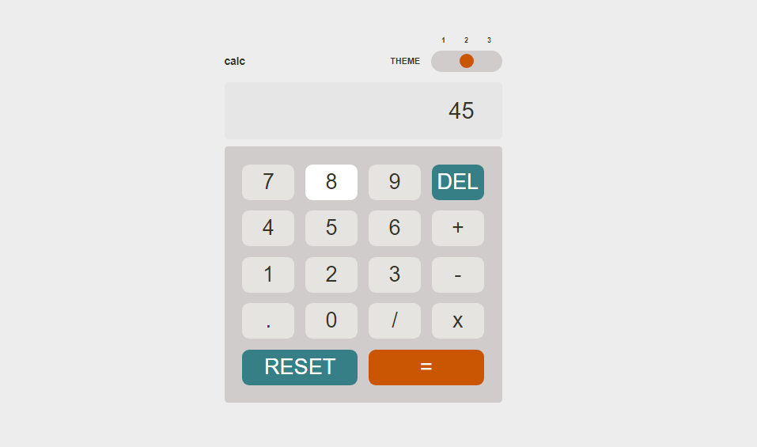

## Table of contents

  - [Screenshot](#screenshot)
  - [Links](#links)
- [My process](#my-process)
  - [Built with](#built-with)
  - [What I learned](#what-i-learned)
- [Author](#author)

### Screenshot

**Desktop view**

**Mobile view**

### Links

- Live Site URL: [Add live site URL here](https://your-live-site-url.com)

## My process

### Built with

- Semantic HTML5 markup
- CSS custom properties
- JavaScript
- CSS Grid

### What I learned

I leart how to sum numbers using Eval() instead of the Reduce method, also how to change the background of elements.

## Author

- Frontend Mentor - [G-best007](https://www.frontendmentor.io/profile/G-best007)
- Twitter - [G-best007](https://www.twitter.com/g_best007)

